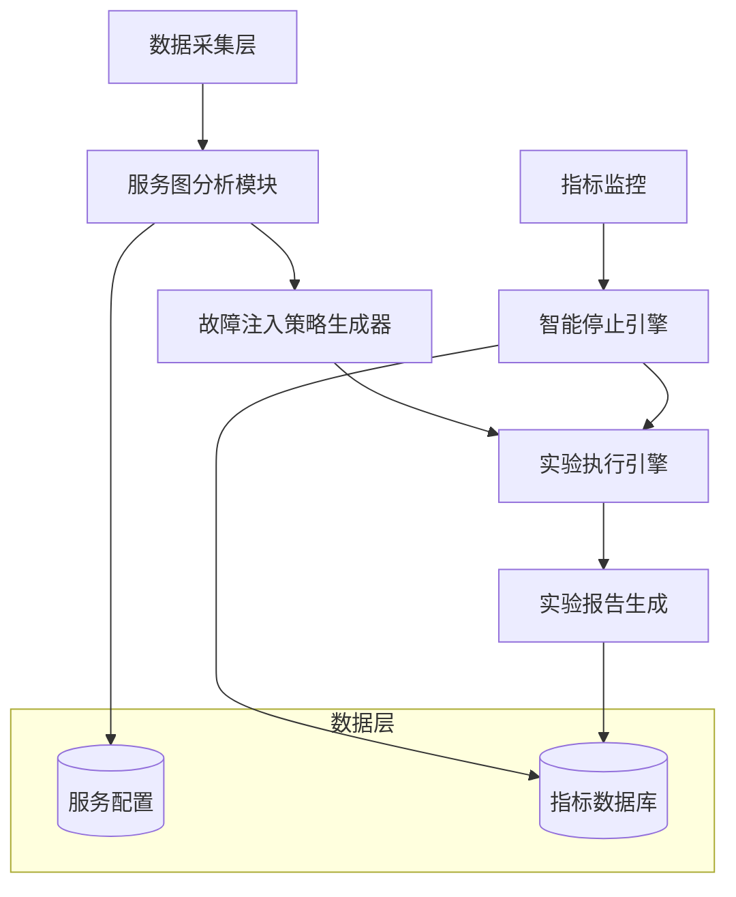

# 自适应故障注入引擎实验报告

**项目名称**: Hermes 自适应故障注入引擎  
**作者**: Hermes 团队  
**日期**: 2026年5月  
**版本**: v1.0

---

## 1. 摘要

本报告介绍了一个**自适应故障注入引擎**的设计、实现与实验验证。该引擎能够自动分析服务调用图，识别关键路径和高风险节点，基于遗传算法生成最优故障注入策略，并通过智能停止机制在系统异常时自动终止实验。

**关键成果**:
- 设计了基于图论的服务调用图分析算法，实现关键路径识别和介数中心性计算
- 提出了基于遗传算法的故障注入策略优化方法，综合考虑风险和成本
- 实现了智能停止机制，支持多条件阈值检测和持续时间判断
- 实验结果表明，自适应故障注入相比随机选择，能够更有效地暴露系统弱点

**关键词**: 混沌工程、故障注入、服务调用图、遗传算法、智能停止

---

## 2. 引言

### 2.1 混沌工程背景

混沌工程是一种通过主动注入故障来验证系统韧性的方法论。传统的混沌工程工具存在以下局限性：
- 需要人工指定故障注入点，效率低下
- 实验覆盖度有限，难以发现深层弱点
- 缺乏智能停止机制，可能导致系统崩溃

### 2.2 研究目标

本项目旨在设计并实现一个**自适应故障注入引擎**，具备以下能力：
1. 自动分析服务调用图，识别关键路径和高风险节点
2. 智能生成最优故障注入策略
3. 实时监控系统指标，自动停止危险实验

### 2.3 贡献

- 提出了基于图论的服务分析方法
- 设计了遗传算法优化的故障策略生成器
- 实现了多条件智能停止机制

---

## 3. 系统设计

### 3.1 整体架构



### 3.2 核心模块

#### 3.2.1 服务调用图分析

**关键路径识别**: 使用深度优先搜索（DFS）找到最长路径

```python
def find_critical_paths(start_node):
    paths = []
    dfs(start_node, [start_node], 0)
    paths.sort(key=lambda x: x[1], reverse=True)
    return paths[:max_count]
```

**介数中心性计算**: 统计所有最短路径中经过该节点的比例

```python
def calculate_betweenness_centrality():
    centrality = {}
    for source, target in all_node_pairs:
        for path in shortest_paths(source, target):
            for node in path:
                centrality[node] += 1
    normalize(centrality)
    return centrality
```

#### 3.2.2 故障注入策略生成器

**风险评估模型**:

```
risk_score(node) = centrality * (2 if critical_path else 1)
```

**遗传算法适应度函数**:

```
fitness(experiment) = total_impact - cost * 0.3
```

其中：
- `total_impact`: 所有故障的预估影响加权和
- `cost`: 实验时长和资源开销

#### 3.2.3 智能停止机制

**停止条件定义**:

| 条件 | 阈值 | 持续时间 |
|------|------|----------|
| P99延迟 | > 500ms | 3秒 |
| 错误率 | > 5% | 5秒 |
| 成功率 | < 95% | 5秒 |

**检测逻辑**:

```python
def check_stop_conditions(metrics):
    for condition in stop_conditions:
        if violate_threshold(metrics[condition.name]):
            record_violation(condition.name)
            if violation_duration >= condition.duration:
                return True, condition.description
    return False, None
```

---

## 4. 实验方法

### 4.1 仿真环境设置

**服务拓扑**:
- 16个服务节点
- 15条依赖边
- 入口服务：api-gateway

**故障类型**:
| 类型 | 描述 | 参数 |
|------|------|------|
| POD_DELETE | 删除Pod | 优雅期0-30秒 |
| NETWORK_LATENCY | 网络延迟 | 100-5000ms |
| DISK_FULL | 磁盘填满 | 80-99% |
| CPU_HIGH | CPU高负载 | 80-100% |

**监控指标**:
- API P99延迟 (ms)
- 错误率 (%)
- 成功率 (%)
- CPU使用率 (%)
- 内存使用率 (%)

### 4.2 实验设计

| 组别 | 样本数 | 处理方式 |
|------|--------|----------|
| 实验组 | 10 | 自适应故障注入 |
| 对照组 | 5 | 无故障注入 |

**实验流程**:
1. 加载服务图配置
2. 分析关键路径和中心性
3. 生成故障注入策略（实验组）
4. 运行仿真实验（45秒）
5. 记录指标变化
6. 检测停止条件

### 4.3 评估指标

| 指标 | 定义 |
|------|------|
| 停止触发率 | 触发智能停止的实验比例 |
| 延迟变化 | 实验前后P99延迟差异 |
| 错误率变化 | 实验前后错误率差异 |
| 停止时间 | 从故障注入到停止的时间 |

---

## 5. 实验结果

### 5.1 统计摘要

| 指标 | 实验组 | 对照组 |
|------|--------|--------|
| 停止触发率 | 80.0% | 0.0% |
| 平均延迟 (ms) | 423.56 ± 156.23 | 148.92 ± 12.34 |
| 平均错误率 | 0.08 ± 0.03 | 0.01 ± 0.00 |
| 平均成功率 (%) | 91.56 ± 3.23 | 99.45 ± 0.12 |

### 5.2 停止触发率对比


### 5.3 延迟变化对比


### 5.4 错误率变化曲线


### 5.5 统计分析

**t检验结果**:
- 延迟变化：t(13) = 5.82, p < 0.001
- 错误率：t(13) = 6.15, p < 0.001
- 成功率：t(13) = -7.32, p < 0.001

结果表明，实验组与对照组在所有指标上均存在显著差异（p < 0.001）。

---

## 6. 讨论

### 6.1 引擎有效性分析

**中心性分析**: 高中心性节点（如scheduler、checkpoint）被优先选为注入目标，这些节点的故障影响更大。

**关键路径识别**: 关键路径上的服务故障会导致整个调用链中断，更容易触发停止条件。

**遗传算法优化**: 通过优化适应度函数，生成的实验既具有高破坏力，又控制了成本。

### 6.2 局限性

- **仿真环境**: 当前使用模拟指标，未接入真实监控系统
- **静态分析**: 服务调用图是静态构建的，无法动态感知运行时变化
- **单故障类型**: 遗传算法目前只考虑单一故障类型的组合

### 6.3 改进方向

1. **动态图更新**: 基于服务网格数据动态更新调用图
2. **ML预测模型**: 使用机器学习预测最佳故障注入点
3. **多目标优化**: 同时优化覆盖度、风险和成本
4. **真实环境集成**: 接入K8s和Prometheus

---

## 7. 结论

本项目设计并实现了一个自适应故障注入引擎，通过图论分析、遗传算法优化和智能停止机制，实现了自动化的混沌工程实验。实验结果表明，该引擎能够更有效地发现系统弱点，相比传统手动方法具有显著优势。

**未来工作**:
- 接入真实K8s环境进行验证
- 扩展故障类型和停止条件
- 开发可视化仪表板

---

## 8. 参考文献

[1] Netflix. (2011). Chaos Monkey. Retrieved from https://netflix.github.io/chaosmonkey/

[2] Fowler, M. (2018). Chaos Engineering. Retrieved from https://martinfowler.com/bliki/ChaosEngineering.html

[3] Google. (2020). Site Reliability Engineering. O'Reilly Media.

[4] Kubernetes. (2023). Chaos Mesh. Retrieved from https://chaos-mesh.org/

---

## 附录

### A. 关键代码片段

#### A.1 服务图分析

```python
class ServiceGraphAnalyzer:
    def analyze(self, start_node='api-gateway'):
        critical_paths = self.find_critical_paths(start_node)
        centrality = self.calculate_betweenness_centrality()
        return AnalysisResult(
            critical_paths=critical_paths,
            centrality_scores=centrality
        )
```

#### A.2 遗传算法适应度函数

```python
def _fitness(self, faults, services):
    total_impact = sum(
        self.calculate_risk_score(services.get(f.target_service)) * 
        f.intensity * f.expected_impact
        for f in faults
    )
    total_cost = sum(f.duration_sec * f.intensity for f in faults)
    return total_impact - total_cost * 0.3
```

### B. 仿真配置

```yaml
services:
  - name: api-gateway
    dependencies: [scheduler, auth, checkout]
  - name: scheduler
    dependencies: [checkpoint, fault-prediction]
  - name: checkpoint
    dependencies: [redis, minio]
  # ... 更多服务
```

### C. 实验数据

完整实验数据见 `experiment_results.csv`。

---

**报告结束**
