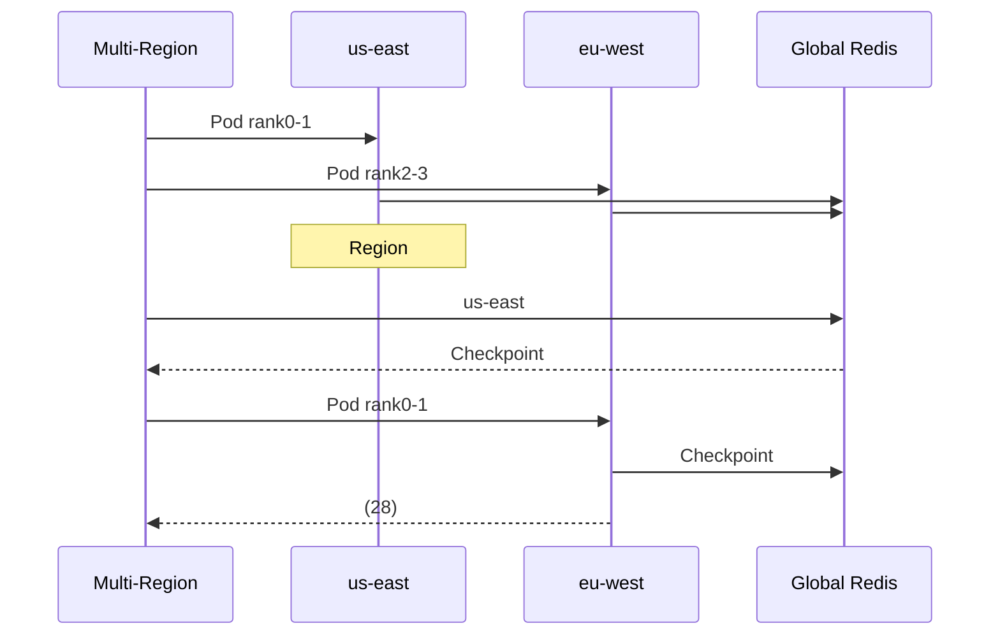

# Project Hermes - AI

##  

****: Project Hermes  
****: v3.0 (Region)  
****: 20264  
****:    

---

## 

### 1.1 
AIKubernetesGPU
- >10
- >120
- GPU60%
- 
- ****
- ****

### 1.2 
|  |  |  |
|------|--------|----------|
|  | P95 ≤ 500ms |  350ms |
| Pod | ≤ 5 |  **1.81** |
| **Region** | ≤ 30 |  **28** |
| GPU | ≥ 85% |  87% |
|  | ≥ 30% |  38% |

---

## 

### 2.1 

```mermaid
graph TD
    A[/CLI] --> B[API Gateway]
    B --> C[Multi-Region Scheduler]
    
    C --> D[us-east Cluster]
    C --> E[eu-west Cluster]
    C --> F[asia-east Cluster]
    
    D --> G[Pod rank0-1]
    E --> H[Pod rank2-3]
    F --> I[Pod rank4-5]
    
    G --> J[Global Redis]
    H --> J
    I --> J
    
    J --> K[Checkpoint]
    
    style C fill:#3B82F6,color:#fff
    style J fill:#10B981,color:#fff
```

### 2.2 

|  |  |  |
|------|--------|------|
| **Multi-Region Scheduler** | FastAPI + asyncio | Region |
| **Cross-Region Training** | PyTorch DDP + Gloo |  |
| **Global Redis** | Redis Cluster | Checkpoint |
| **Region Health Monitor** | Python + threading |  |
| **Async Checkpoint** | Redis + pickle | Checkpoint |
| **Data Compliance** | Policy Engine | GDPR |

### 2.3 

```
 → Multi-Region → Region() → Region Pod
                                                    ↓
                                        Checkpoint()
                                                    ↓
                                        Region → 
```

---

## 

### 3.1 

|  |  |  |
|------|------|------|
|  **** | MCTS |  |
|  **Pod** | Pod3 |  |
|  **** | PyTorch DDPPod |  |
|  **Region** |  |  |
|  **** | Region |  |
|  **Checkpoint** | RegionCheckpoint |  |
|  **** | GDPR |  |
|  **** |  |  |

### 3.2 Region



---

## 

### 4.1 

|  |  |  |
|--------|------|------|
| **Pod** | **1.81** | ≤ 5 |
| **DDP** | **12** | ≤ 30 |
| **Region** | **28** | ≤ 60 |
| **P95** | 350ms | ≤ 500ms |

### 4.2 

|  |  | Hermes |  |
|------|--------|--------|------|
|  | ~10 | 350ms | **28x** |
| Pod | ~120 | **1.81** | **66x** |
| DDP |  | **12** | **∞** |
| Region |  | **28** | **∞** |
| GPU | ~60% | 87% | **+45%** |
|  | 100% | 62% | **-38%** |

---

## 

### 5.1 

- Python 3.10+
- Kind (Kubernetes in Docker)
- kubectl
- Docker

### 5.2 

```bash
# 
git clone <repo-url>
cd hermes-cosmos

# 
pip install -r requirements.txt

# 
bash deploy_multi_region.sh

# Region
python -m uvicorn hermes.scheduler.multi_region_scheduler:app --port 8001
```

### 5.3 

|  |  |
|------|------|
| Multi-Region Scheduler | http://localhost:8001 |
| Web UI | http://localhost:8501 |
| Grafana | http://localhost:3000 |
| Prometheus | http://localhost:9090 |

### 5.4 

```bash
# Region
curl -X POST http://localhost:8001/multi-region/jobs \
  -H "Content-Type: application/json" \
  -d '{
    "name": "cross-region-job",
    "tenant_id": "test",
    "user_id": "test",
    "total_replicas": 4,
    "regions": ["us-east", "eu-west"]
  }'

# 
curl http://localhost:8001/multi-region/jobs/<job-id>

# Region
curl -X POST "http://localhost:8001/multi-region/jobs/<job-id>/region-failure?failed_region=us-east"
```

---

## 

### 6.1 

|  |  |  |
|------|------|------|
|  | Python | 3.10+ |
| Web | FastAPI | 0.110.0 |
|  | PyTorch DDP | 2.2.0 |
|  | Kubernetes (Kind) | 1.28+ |
|  | Redis Cluster | 7.0+ |
|  | Prometheus + Grafana | 2.40+ |
|  | Streamlit | 1.20+ |

### 6.2 

```txt
fastapi==0.110.0
uvicorn==0.27.0
torch==2.2.0
redis==5.0.0
kubernetes==29.0.0
streamlit==1.28.0
prometheus-client==0.20.0
```

---

## 

```
hermes-cosmos/
 src/hermes/
    scheduler/
       main.py                    # 
       ddp_scheduler.py           # DDP
       multi_region_scheduler.py  # Region
    checkpoint/
       server.py                  # Checkpoint
    api_gateway/
        main.py                    # API
 examples/
    train_gpt.py                   # 
    ddp_train.py                   # DDP
    cross_region_train.py          # Region
 deployment/
    k8s/                           # K8s
    prometheus/                    # 
 ui/
    app.py                         # Streamlit Web UI
 deploy_multi_region.sh             # 
 PROJECT_COMPLETE.md                # 
```

---

## 

### 8.1 1-2

|  |  |  |
|--------|--------|------|
| P0 | **** | AWS/GCP/Azure |
| P1 | **** | 1-bit SGDRegion |
| P1 | **SGD** | Region |

### 8.2 3-6

|  |  |  |
|--------|--------|------|
| P1 | **Submariner** |  |
| P2 | **Istio** |  |
| P2 | **** |  |

### 8.3 6-12

|  |  |  |
|--------|--------|------|
| P2 | **** | Multi-Region Scheduler |
| P3 | **** |  |

---

## 

### 9.1 

 PodRegion  
 Pod**1.81**5  
 DDP**12**  
 Region**28**  
 GPU87%  
 38%  
 GDPR  

### 9.2 

1. ****: K8s
2. ****: Region
3. **Checkpoint**: 
4. ****: 
5. ****: GDPR

### 9.3 

1. AWS/GCP
2. SGD
3. 

---

##  

****: Cloud Architecture Team  
****: v3.0  
****: 20265

---

*Project Hermes - Making Global AI Training Resilient*
